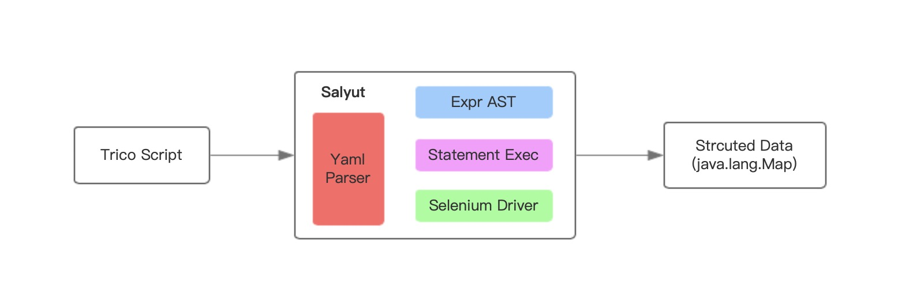

<p align="right"><a href="README.md">中文</a> | EN</p>

# Salyut

The open-source markup-language of spider-framework. [Learn more about the salyut grammar.](https://www.trico.cloud/tricoDoc/overview/index.html)

[]() 
[]()
[](https://travis-ci.org/shenruisi/salyut)

**Salyut** is a parser and execute engine of *trico script*. You can run and get result from *trico script* by **Salyut**. Due to **Salyut** is an open-source project,you can custom your own expression under [expr]() or custom your own token under [token]().

**Salyut** based on

* Lexical analysis by [Yaml](https://yaml.org). If you have experience with *Yaml*, it should be easy to understand the language struct of trico script.

* Control the browser by [Selenium](https://www.selenium.dev/). If you have experience with *Selenium*,it should be easy to extend the funnction of trico script.

## Sample Script ##
```yaml
- segment: #This is a trico script sample. A web calculator.
    name: '"calc"'
    args: {0: '/input'}
    body:
    - load: '"http://www.baidu.com"' #load page of Baidu
    - wait: {ele: '#su', type: '"presence"'} #wait element appear
    - fill: {ele: '#kw', value: '$/input'}
    - click: {ele: '#su'} #click search button
    - wait: {ele: '.op_new_val_screen_result', type: '"presence"'} #fetch the result
    - select: {ele: '.op_new_val_screen_result', path: '/result'}
    - put: { path: '/resultInt', value: '$/result', lambda: 'x -> return parseInt(x)'}
    - return: '$/resultInt'
- callin: {seg: '"calc"', 0: '"1+1"'} #call the segment named 'calc' and pass the argument '1+1'
- return: '$1'
```

## Usage ###
* Invoke with jar.

	1.run `mvn clean package`

	2.`cd target`

	3.`java  -Dscript.path=../sample/webCalc.tr -Ddriver.path=../env/geckodriver-macOS  -classpath salyut-jar-with-dependencies.jar com.trico.salyut.Salyut`

	4.java opts parameters.
	* **script.path** - The path of the script which you want to execute. Find the sample in [sample](/sample) folder.
	* **driver.path** - The path of the driver binary. Find it in [env](/env) folder.
	* **segment.path** - The directory of preload .tr file.
	* **headless** - Use headless browser or not.
	* **browser.count** - The max count of the browsers.
	* **newTab.path** - The file which salyut used to create new tab. Find it in [env](/env) folder.

* Write code to invoke.

```java
Salyut.setEnv(EnvKey.DRIVER_PATH,{your driver path});
Salyut.setEnv(EnvKey.NEW_TAB_PATH,{your newTab file path});

Salyut.launch();
Salyut.setOutputListener(
        msg -> {
            //Deal with the message.
        }
);
Salyut.setResultListener(
        result -> {
            //Deal with return value.
        }
);
String script = {your script content};
TricoScript script = new TricoScript(yaml);
Salyut.execScript(script.getContent(),"","");
```

## Maven ##
```mvn
<dependency>
    <groupId>com.trico.salyut</groupId>
    <artifactId>salyut</artifactId>
    <version>0.0.8-SNAPSHOT</version>
</dependency>
```

## Architecture ##




## Licensing ###
**Salyut** is under [Apache 2.0](https://www.apache.org/licenses/LICENSE-2.0) license,so you can download for free,modified,and deploy the source code. Also you can build a SaaS platform dependent on **Salyut** to get a more powerful business processing capability.

**Salyut** added [Commons Clause 1.0](). Limit business sale SaaS deployment dependent on **Salyut**. As mentioned above, we fully commit to the open source community.If you have some great idea about commercializing **Salyut**, please feel free to contact with us at feedback@trico.cloud.

## Business Application ###
Now **Salyut** is already served [Trico Cloud](https://www.trico.cloud) platform. *Trico Cloud* is devoted to provide spider cloud-native services and offer a range of  high availability, low cost data fetching solutions.

## Contact ###
* email: feedback@trico.cloud
* email: tigris.shin@gmail.com
